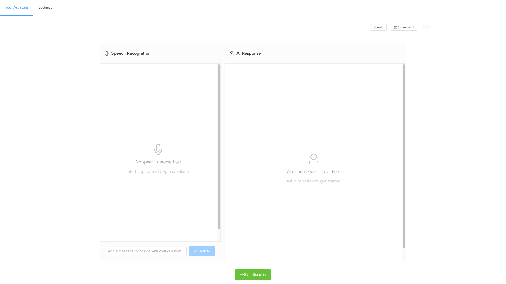
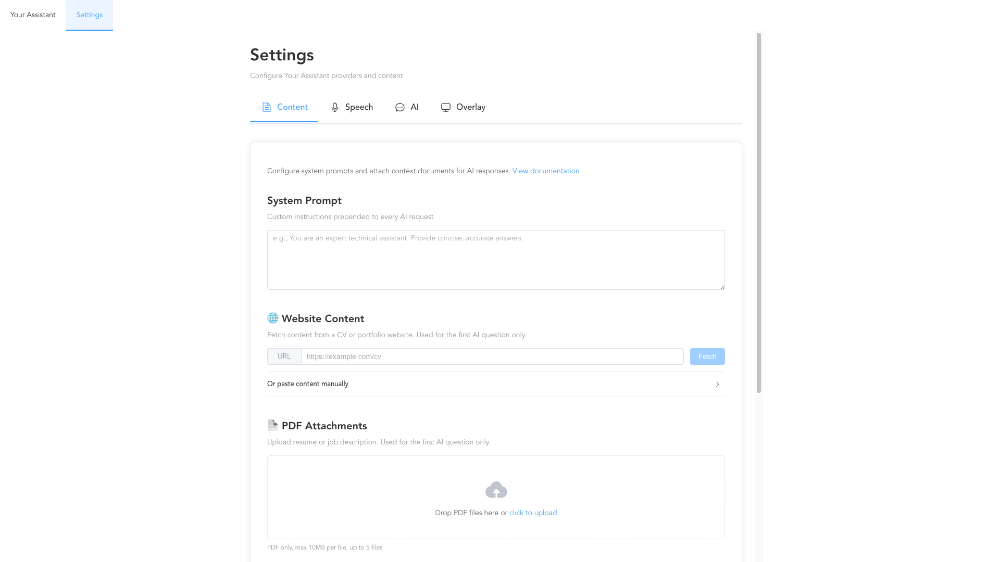
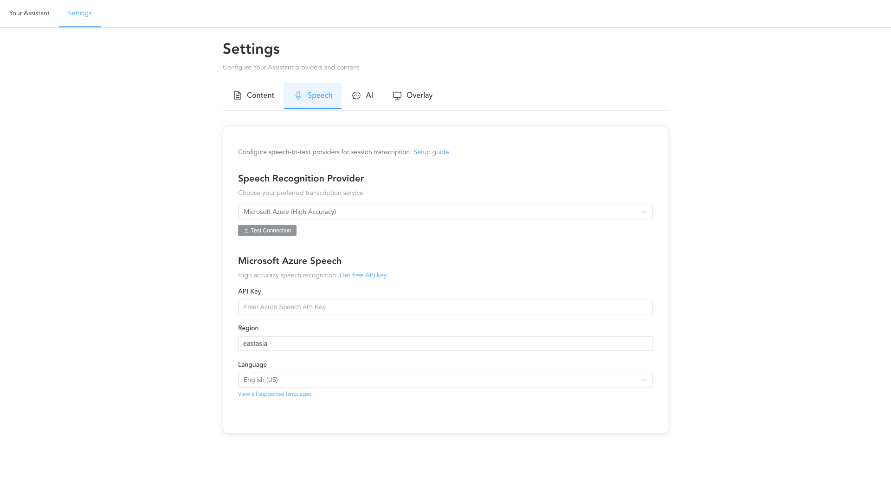
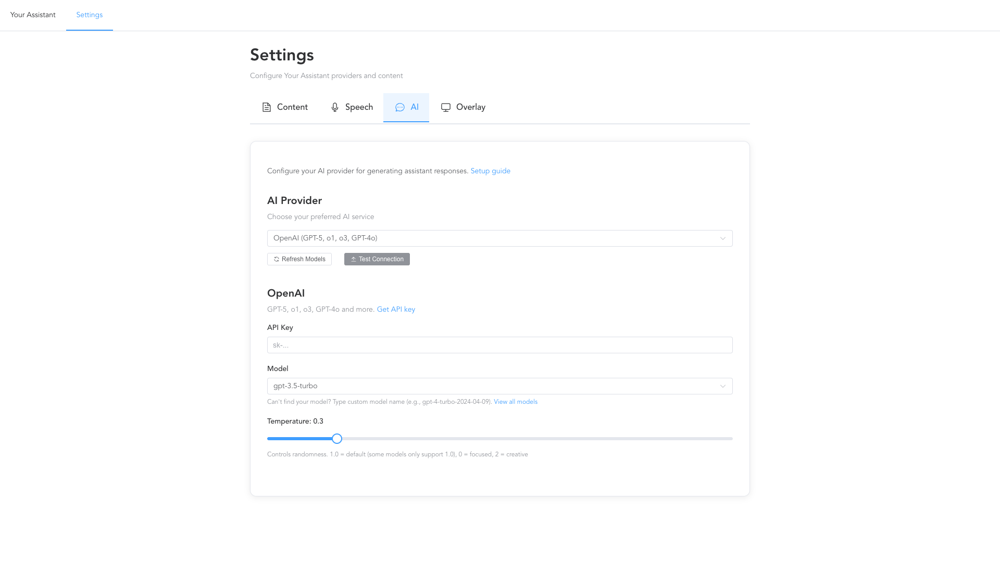
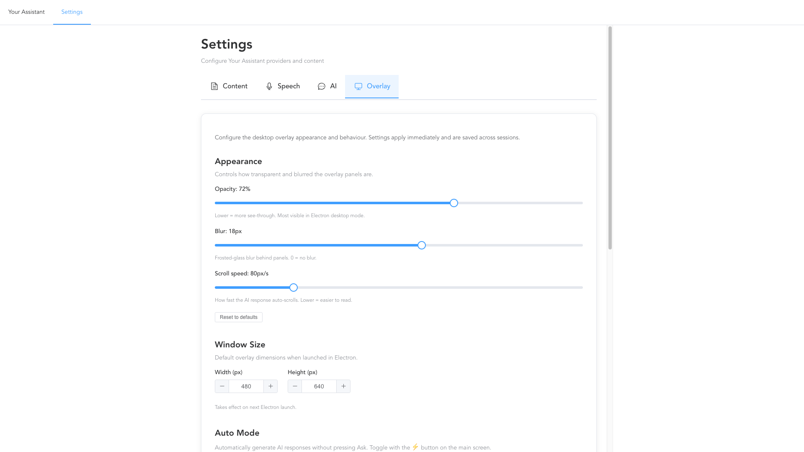

# Your Assistant

> Real-time AI-powered assistant with multi-provider speech recognition and intelligent response generation

**Online Demo:** https://gannino.github.io/your-assistant/#/

Your Assistant is a cross-platform web application that listens to live audio, transcribes speech in real-time, and generates intelligent AI responses to help you during any session — meetings, research, or any scenario where you need an AI copilot.

## Application Screenshots

### Main Interface


### Settings Pages
The application provides comprehensive settings for configuring AI providers, speech recognition, and content management:

- **Content Settings** - Configure PDF and website context sources
  
- **Speech Settings** - Choose transcription providers and language settings  
  
- **AI Settings** - Configure language models and response behavior
  
- **Overlay Settings** - Configure desktop app appearance and behavior
  


## Features

- **Multi-Provider Architecture** — Choose from 6 AI providers and 4 transcription providers
- **Real-time Transcription** — Continuous speech-to-text with multiple accuracy/latency options
- **Streaming AI Responses** — Answers stream in real-time with markdown rendering
- **Session History** — Automatic rolling summary of Q&A exchanges built in the background
- **Session Summarization** — One-click summary of the full session transcript and responses
- **Context Enrichment** — Attach PDFs or websites as reference material, pre-summarized for instant responses
- **Chat Input** — Add your own messages alongside transcribed speech before asking AI
- **Screenshot Support** — Capture screen (Cmd+H) and include images in AI requests
- **Auto Mode** — Automatically fires AI responses after configurable silence delay; optional screenshot polling
- **Overlay Mode** — Document Picture-in-Picture (Chrome 116+) or CSS fixed overlay
- **Serverless** — All API keys stored locally in your browser, no backend required
- **Cross-platform** — Works on Windows, Mac, iOS, Android, tablets
- **Free Options** — Web Speech API + Ollama/MLX requires no API keys
- **Electron Desktop App** — Transparent always-on-top overlay with global shortcuts and configurable opacity

## Quick Start

**Choose your experience:**

### 🌐 Web Browser (Easiest)

1. Visit: https://gannino.github.io/your-assistant/#/
2. Configure your AI provider
3. Start using immediately!

### 💻 Desktop App (Recommended)

1. **Download pre-built app** from [GitHub Releases](https://github.com/gma/your-assistant/releases)
2. Install and run
3. Configure your AI provider
4. Enjoy always-on-top overlay!

**Or build from source:**

1. Clone repository
2. `npm install`
3. `npm run electron:dev` (development) or `npm run electron:build` (build)

👉 **[Full Quick Start Guide](./docs/QUICK_START.md)**

## Downloads

### 🎁 Pre-Built Desktop Apps

**Latest Release:** [github.com/gma/your-assistant/releases](https://github.com/gma/your-assistant/releases)

#### Available Platforms:

| Platform | Download | Size | Requirements |
|----------|----------|------|--------------|
| **macOS** | `Your Assistant-0.1.0-arm64.dmg` | ~140 MB | macOS 11+ (Apple Silicon M1/M2/M3/M4) |
| **Windows** | `Your Assistant-0.1.0-setup.exe` | ~145 MB | Windows 10/11 (x64) |
| **Linux** | `Your-Assistant-0.1.0.AppImage` | ~150 MB | Ubuntu/Debian/Fedora (x64) |

#### Installation:

**macOS:**
1. Download `.dmg` file
2. Open and drag "Your Assistant" to Applications
3. Launch from Applications folder
4. **Note:** You may need to right-click → Open on first launch (unsigned app)

**Windows:**
1. Download `.exe` installer
2. Run installer
3. Launch from Start Menu or desktop shortcut

**Linux:**
1. Download `.AppImage` file
2. Make executable: `chmod +x Your-Assistant-*.AppImage`
3. Run: `./Your-Assistant-*.AppImage`

#### Features in Desktop App:

✅ **Transparent Overlay** - Always-on-top window that floats over other apps
✅ **Global Shortcuts** - Show/hide with Cmd+Shift+Space
✅ **Window Movement** - Move with arrow keys
✅ **Configurable Opacity** - Adjust transparency level
✅ **Screenshot Capture** - Silent screen capture included
✅ **No Browser Required** - Standalone desktop application

**Previous Releases:** All releases available at [github.com/gma/your-assistant/releases](https://github.com/gma/your-assistant/releases)

## Supported Providers

### AI Providers

| Provider | Models | API Key | Streaming |
|----------|--------|---------|----------|
| **OpenAI** | GPT-3.5, GPT-4, GPT-4 Turbo | Yes | Yes |
| **Z.ai** | GLM-4 series | Yes | Yes |
| **Ollama** | Llama2, Mistral, CodeLlama | No (local) | Yes |
| **MLX** | Apple Silicon optimized | No (local) | Yes |
| **Anthropic** | Claude 3 (Haiku, Sonnet, Opus) | Yes | Yes |
| **Gemini** | Gemini 1.5 Flash/Pro | Yes | Yes |

### Transcription Providers

| Provider | Accuracy | Latency | API Key | Free Tier |
|----------|----------|---------|---------|----------|
| **Whisper** | 95-98% | 5s | Yes | No |
| **Azure** | 90-95% | 300-500ms | Yes | 5 hrs/mo |
| **Deepgram** | 90-95% | 200-300ms | Yes | 200 hrs/mo |
| **Web Speech** | 85-90% | <100ms | No | Unlimited |

## Why Your Assistant?

Other tools only work on specific platforms and are hard to install. Your Assistant works everywhere:

|  | Windows | Mac | Mobile |
|---|---------|-----|--------|
| Cheetah | ❌ | ✅ | ❌ |
| Ecoute | ✅ | ❌ | ❌ |
| **Your Assistant** | ✅ | ✅ | ✅ |

## Security

- **API keys** are stored only in browser `localStorage` — never sent to any server except your chosen provider
- **SSRF protection** — all user-supplied URLs (website context fetch) are validated against a blocklist of private/loopback IP ranges and non-HTTP protocols before any request is made
- **XSS protection** — speech recognition transcripts are sanitized with DOMPurify before rendering
- **Electron** — runs with `contextIsolation: true` and `nodeIntegration: false`; all renderer ↔ main communication goes through the preload context bridge

## Development

```bash
npm install

# Web dev server
npm run serve           # HTTP  :8080
npm run serve:https     # HTTPS :8080 (required for microphone on mobile)

# Electron
npm run electron:dev        # HTTP
npm run electron:dev:https  # HTTPS (required for microphone)

# Build
npm run build           # production build → dist/
npm run electron:build  # package desktop app → release/

# Quality
npm run lint            # ESLint auto-fix
npm run lint:check      # ESLint check only
npm test                # Jest unit tests
npm run test:deployment # build + smoke test
```

## Documentation

- **[Quick Start](./docs/QUICK_START.md)** — Get running in 5 minutes (web + Electron)
- **[Architecture Guide](./docs/ARCHITECTURE.md)** — Complete technical overview including composables and security
- **[Mobile Guide](./docs/MOBILE_GUIDE.md)** — Mobile support guide
- **[Release Process](./docs/RELEASE_PROCESS.md)** — How releases are managed with Release Please
- **[GitHub Actions Setup](./docs/GITHUB_ACTIONS_SETUP.md)** — CI/CD pipeline configuration
- **[Linting and Testing](./docs/LINTING_AND_TESTING.md)** — Code quality and testing setup
- **[AI Providers Setup](./docs/AI_PROVIDERS_SETUP.md)** — Configure each AI provider
- **[Transcription Providers Setup](./docs/TRANSCRIPTION_PROVIDERS_SETUP.md)** — Configure each transcription provider
- **[FAQ](./docs/FAQ.md)** — Common questions
- **[Troubleshooting](./docs/TROUBLESHOOTING.md)** — Fix common issues including SSRF errors and Electron warnings
- **[Provider Comparison](./docs/PROVIDER_COMPARISON.md)** — Compare providers
- **[Development Guide](./docs/DEVELOPMENT_GUIDE.md)** — For contributors

## License

Apache License 2.0 — See LICENSE file

## Contributing

Contributions welcome! See [Development Guide](./docs/DEVELOPMENT_GUIDE.md) for details.

**Inspired by:** [Interview-Copilot](https://github.com/interview-copilot/Interview-Copilot) - This project is an extended and enhanced version of the original Interview-Copilot, with additional features, improved architecture, and broader use cases beyond just interviews.

## Release Automation

This project uses a hybrid release system:

- **Automated**: Release Please creates Release PRs automatically based on conventional commits
- **Manual**: Use `npm run release:patch` for immediate releases when needed

Both methods create identical releases with all platform artifacts.
## Features

### Hybrid Release System
- Release Please automation for version management
- Manual release scripts for immediate releases
- Both methods create identical releases
# Release Testing


